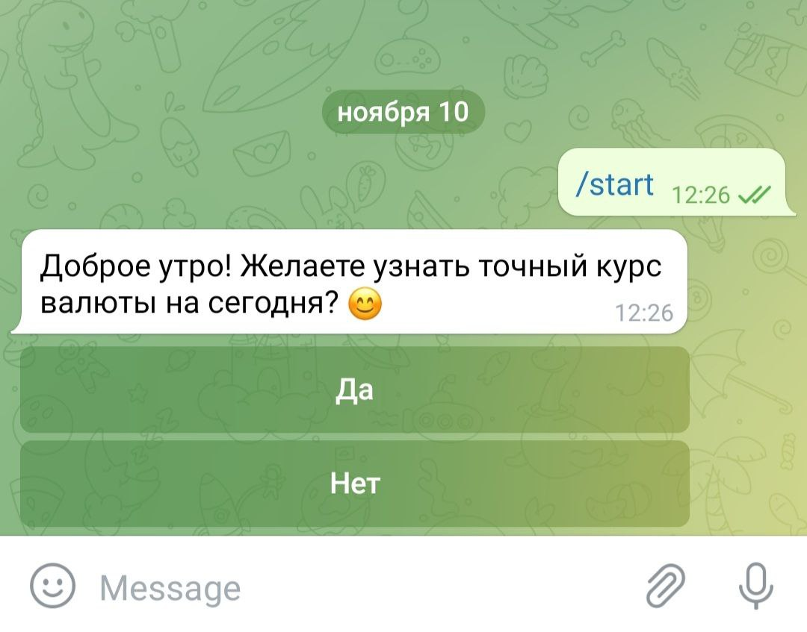

# Currency Rate 

Курс любой валюты постоянно находится в изменчивом состоянии. Отслеживание динамики валютного курса вручную не всегда является оптимальным решением. Поэтому для автоматического трекинга колебания курса валюты с помощью Python был разработан TelegramBOT - <i>CurrencyRate.</i> 

### Описание проекта

<i><b>CurrecyRate</i></b> - чат-бот, выполняющий функцию «финансового консультанта». Бот ведет с пользователем осмысленный диалог, при желании юзера информирует его о текущем курсе интересующей валюты. Кроме того, перенаправляя пользователя на необходимую страницу, бот предлагает узнать последние события, произошедшие в экономической сфере общества. Формулировки достаточно нейтральны и понятны человеку с любым уровнем развития.

***  

### Установка

1. Установить telegram на ПК и зарегистрироваться в мессенджере;
2. Найти в поиске @BotFather – это отец всех ботов в telegram, именно он их создаёт;
3. Написать ему /newbot и ответить на два простых вопроса: имя бота и его username;

@BotFather поздравит нас с успешным созданием бота и отправит нам его token, который необходимо вставить в командную строку для запуска бота.

    bot = telebot.TeleBot('token')

***

### Структура проекта

Первое, что необходимо сделать - это установить все библиотеки, которые понадобятся для работы в дальнейшем.
Выполняем установку необходимых библиотек:

    import emoji # Модуль, который позволяет использовать emoji
    import telebot #  библиотека для создания бота на python для телеграмма
    import time # Модуль для решения задач, связанных со временем
    import requests # Модуль для обработки URL
    import locale # Модуль для локализации (для решения проблемы ф-я под определенную культуру)
    from datetime import datetime 
    from bs4 import BeautifulSoup # Модуль для работы с HTML
  

Далее нам необходимо грамотно написать весь код для корректной работы нашей программы. Для упрощения разберем весь код на отдельные составляющие:

* Парсинг (копирование) данных из страницы поисковой выдачи Google.

        BYN_CURRENCY = 'https://select.by/kurs/' # Ссылка на страницу, откуда берутся данные о текущем курсе валют
        full_page = requests.get(BYN_CURRENCY) # Парсим всю страницу
        soup = BeautifulSoup(full_page.content, 'html.parser') # Разбираем через BeautifulSoup
        convert = soup.findAll('span', {'itemprop':    'price'}) # Получаем нужное для нас значение 
        convert_1 = soup.findAll('td', {}) # Получаем нужное для нас значение 

* Желание пользователя узнать текущий курс валюты. Предложение просмотра новостей. 

Для взаимодействия с пользователем, т.е. для ответа на его команды и сообщения создаем хэндлеры. Первоначально ответим на команду /start. Для этого передаём в message_handler параметр commands c командой start, на которую чат-бот будет отвечать описанным ниже образом. 
Создаем первую Inline-клавиатуру (привязывается к сообщению, с которым была отправлена). При инициализации класса InlineKeyboardButton передаем один обязательный параметр - text, который пользователь будет отправлять по нажатию на одну из имеющихся кнопок. Воспользуемся методом add и добавим кнопки ('Да', 'Нет') объекту класса InlineKeyboardMarkup. 

        @bot.message_handler(commands=['start'])
        def greetings(message):
            keyboardI = telebot.types.InlineKeyboardMarkup()
            key_yes = telebot.types.InlineKeyboardButton(text='Да', callback_data='yes')  # кнопка «Да»
            keyboardI.add(key_yes)
            key_no = telebot.types.InlineKeyboardButton(text='Нет', callback_data='no')  # кнопка «Нет»
            keyboardI.add(key_no)

В зависимоти от того, который сейчас час, бот приветствует пользователя соответственно: Доброе утро / Добрый день /Добрый вечер. Атрибут tm_hour функции localtime() модуля time в Python позволяет сравнить текущий час с фиксированным, ввиду чего бот выводит необходимую информацию.

    hour = time.localtime()
    if hour.tm_hour <= 12:
        phrase = emoji.emojize(
            'Доброе утро! Желаете узнать точный курс валюты на сегодня? :smiling_face_with_smiling_eyes:')
    elif hour.tm_hour > 12 and hour.tm_hour <= 17:
        phrase = emoji.emojize(
            'Добрый день! Желаете узнать точный курс валюты на сегодня? :smiling_face_with_smiling_eyes:')
    else:
        phrase = emoji.emojize(
            'Добрый вечер! Желаете узнать точный курс валюты на сегодня? :smiling_face_with_smiling_eyes:')

 

Далее используем send_message, в него записываем id чата (его можно достать из message.chat.id), в который необходимо отправить сообщение и, собственно, само сообщение (phrase).

    bot.send_message(message.chat.id, phrase, reply_markup=keyboardI)

Теперь нам необходимо сделать обработчики кнопок. Это отдельные функции, которые необходимо зарегистрировать при помощи декоратора callback_query_handler. Эта функция будет получать объект callback_obj, который хранит информацию о нажатии кнопки. В частности, помимо обычных данных о пользователе, чате и т.д. у этого объекта есть поле data, в котором хранится та самая информация, которая была привязана к кнопке. 

func=lambda call: True - это лямбда-функция, которая в данном случае всегда возвращает True. Это означает, что данный обработчик будет применяться ко всем callback-запросам. 

    @bot.callback_query_handler(func=lambda call: True)
    def callback_worker_1(call):
    keyboardR = telebot.types.ReplyKeyboardMarkup(resize_keyboard=True, one_time_keyboard=True)

    if call.data == 'yes':
        buttons = ['Доллар США', 'Евро', 'Российский рубль', 'Злотый', 'Гривна']
        keyboardR.add(*buttons)
        bot.send_message(call.message.chat.id, 'Чудесно :) Курс какой валюты Вас интересует? ', reply_markup=keyboardR)
    elif call.data == 'no':
        buttons = ['Конечно', 'Пожалуй, нет!']
        keyboardR.add(*buttons)
        bot.send_message(call.message.chat.id, 'Понял:) В таком случае могу предолжить Вам прочесть последние новости!',
                         reply_markup=keyboardR)

Таким образом, если пользователь нажимает кнопку "Да", бот отправляет соответствующее сообщение. Пользователю представлен уже другой тип клавиатуры, а именно ReplyKeyboardMarkup (шаблоны сообщений):

Если пользователь желает узнать текущий курс валюты, перед ним возникает клавиатура, позволяющая сделать выбор.

 

Если пользователь отказывается узнать курс валюты, бот предлагает ему прочесть последние новости.

 

* 
Предоставление пользователю интересующей его информации (курса валюты, ссылки на веб-страницу). Прощание с пользователем.

Далее следуент хендлер, который в зависимости от принятого от пользователя сообщения отправляет заложенные данные.

        @bot.message_handler(content_types=['text'])
        def default_test(message):

Для данного хэндлера возможно три исхода событий, а именно:

1. Если пользователь соглашается прочесть новости, перед ним возникает InlineButton, механизм работы которой был рассмотрен ранее. Однако в данном случае используется уже иной тип кнопки, а именно URL-кнопка. Указываем интересующий нас url (поддерживаются только протоколы HTTP(S) и tg://), даем кнопке подходящее по смыслу название.

    if message.text == 'Конечно':
       url_button = telebot.types.InlineKeyboardButton(text= "Перейти к новостям", url="https://newssearch.yandex.by/news/rubric/business")
       keyboard = telebot.types.InlineKeyboardMarkup().add(url_button)
       bot.send_message(message.chat.id, emoji.emojize('Нажми на кнопку, чтобы узнать о последних новостях в экономике прямо сейчас :face_with_monocle:'), reply_markup=keyboard)
       bot.send_message(message.chat.id, emoji.emojize('Узнайте последние новости и будьте в курсе всех событий!\nКак только я Вам понадоблюсь, напишите - /start'))
       bot.send_sticker(message.chat.id, 'CAACAgIAAxkBAAEDPjhhiX_Ns9nFyd7paB2WA2QH2Oo2iQACDQADwDZPE6T54fTUeI1TIgQ')

 

При нажатии на появившуюся кнопку, перед пользователем появляется ссылка, перенаправляющая его на предложенную веб-страницу.

 

2. Если пользователь отказывается прочесть последние новости, перед ним всплывает сообщение от бота, в котором он вежливо прощается и предлагает воспользоваться его функционалом в другой раз.

    elif message.text == 'Пожалуй, нет!':
        bot.send_message(message.chat.id, "Тогда увидимя в следующий раз \nКак только я Вам понадоблюсь, напишите /start")
        bot.send_sticker(message.chat.id, 'CAACAgIAAxkBAAEDPjhhiX_Ns9nFyd7paB2WA2QH2Oo2iQACDQADwDZPE6T54fTUeI1TIgQ')

 

3. В противном случае, если же пользователь желает узнать текущий курс валюты, бот отправляет юзеру необходимые данные, которые достаются из сформированного ранее словаря CURRENCY_RATE.

    CURRENCY_RATE = {'доллар сша': [convert[0].text, convert[1].text, convert_1[4].text, 'USD', emoji.emojize(":United_States:")],
                 'евро': [convert[2].text, convert[3].text, convert_1[9].text, 'EUR', emoji.emojize(":European_Union:")],
                 'российский рубль': [convert[4].text, convert[5].text, convert_1[14].text,'RUB', emoji.emojize(":Russia:")],
                 'злотый': [convert[6].text, convert[7].text, convert_1[19].text, 'PLN',emoji.emojize(":Poland:")],
                 'гривна': [convert[8].text, convert[9].text, convert_1[24].text, 'UAH',emoji.emojize(":Ukraine:")]}

 
В данной части применяется функционал модуля locale, который используется для форматирования данных под определенную культуру. В нашем случае упомянутый модуль использовался для корректного отображения текущей даты.

    else:
        keyboard = telebot.types.InlineKeyboardMarkup()
        key_yes = telebot.types.InlineKeyboardButton(text='Да', callback_data='yes')  # кнопка «Да»
        keyboard.add(key_yes)
        key_no = telebot.types.InlineKeyboardButton(text='Нет', callback_data='no')  # кнопка «Нет»
        keyboard.add(key_no)

        locale.setlocale(locale.LC_ALL, '')
        today = datetime.today()
        d = today.strftime('%d %b %Y')

        for k, v in CURRENCY_RATE.items():
            if message.text.lower() == k:
                bot.send_message(message.chat.id,
                                 f'Курс BYN по отношению к {v[3]} {v[4]} на {d} г.''\n''\n'
                                 f'Продажа валюты банком: {v[0]}''\n'
                                 f'Покупка валюты банком: {v[1]}''\n'
                                 f'Курс НБ РБ: {v[2]}''\n''\n')
                bot.send_message(message.chat.id, 'Желаете узнать курс другой валюты?', reply_markup=keyboard)

 

Также у пользователя имеется возможность узнать курс и другой валюты, при соглашении ход событий аналогичен.

    @bot.message_handler(func=lambda call: True)
    def currency_2():
    callback_worker_1

 
